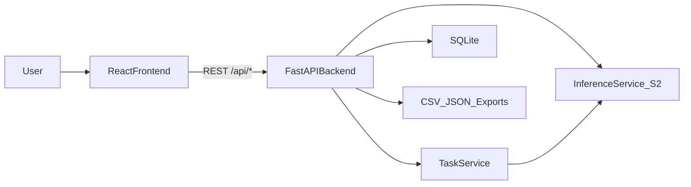

# S2 系统升级说明（论文材料）

## 升级目标

在 S2 最优模型基础上，将原有「单文件上传 + 单次推理」演示升级为可用于毕业设计展示的系统化平台：

- 批量推理
- 阈值交互
- 可视化与结果导出
- 任务管理与审计

## 前后端总体架构

## 功能说明

1. 在线推理：
   - 单文件推理：返回 `P(bonafide)`, `P(spoof)`, 判决标签与可视化数据。
2. 批量推理：
   - 创建任务并异步执行，支持任务状态轮询。
3. 阈值交互：
   - 前端可调阈值，后端输出 `decision_by_threshold` 与 `confidence_gap`。
4. 历史与导出：
   - 结果落库（SQLite）并支持 CSV/JSON 导出。
5. 工程化能力：
   - Token 鉴权、审计日志、任务记录。

## 可复现实验展示建议

- 截图 1：批量上传与任务状态页面
- 截图 2：阈值滑块与边界样本判定
- 截图 3：历史记录表与导出按钮
- 截图 4：波形 + Mel 可视化

## 结论表述模板

“本文在 S2 最优模型的基础上实现了前后端一体化检测系统。系统支持批量推理、阈值交互、结果可视化与导出，并具备基础鉴权、任务管理和审计记录能力，可满足毕业设计演示与实验复现需求。”
